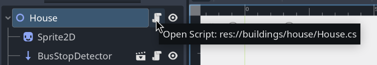
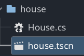

# Directory Structure Guide
Here is a rundown of some of the directories in the project:
```
|── assets # image files (png, svg)
|── docs # .md files for developers to read
|── test # unit tests
|── ui # all Control nodes and attached scripts
|── utils # static helper classes
    |── constants # classes which hold constant values
```
# Scenes & Scripts
Godot scenes that have a script connected to them should always be in the same directory level. The directory name should be the same as the name of the scene.
### Example:

Here, `House.cs` is attached to `house.tscn`.


Thus, those two files should be at the same directory level, with the directory name being `house`.

Overall, use your best judgement on where stuff should go and if you think a directory should be made. I will always give feedback if needed in your PRs.